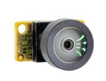
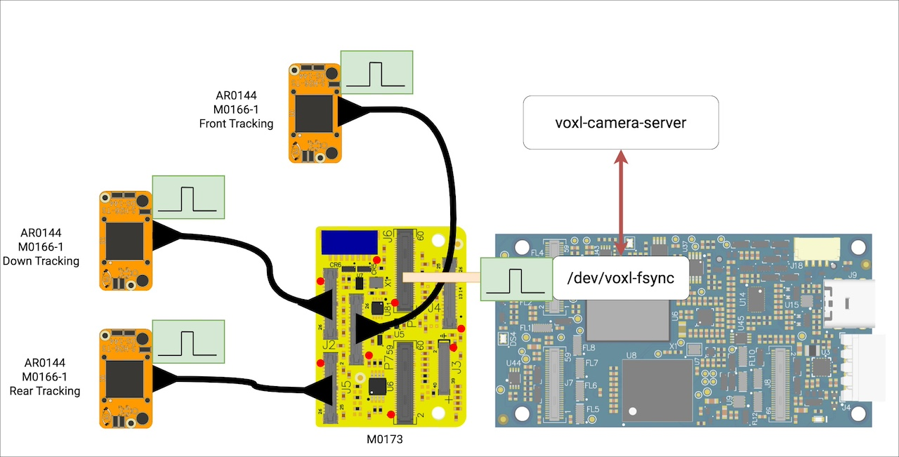

# Hardware setup

## Sensor

The tracking camera targeted for VOXL-based platforms is the **AR0144** image
sensor.



## Wiring

Connect the camera as shown below. The module uses the **D0014-M0173** flex
cable, which plugs into the VOXL camera port used for `camera_id: 1`.



Double-check the cable orientation before powering the board: the contacts face
the connector latch, and the cable seats fully before the latch is closed.

## Verifying the board sees it

With the board powered and `voxl-camera-server` running:

```bash
voxl-list-pipes
```

The `tracking_leg` pipes should appear once the camera is configured - see
[camera-configuration.md](camera-configuration.md). If nothing shows up, the
camera is either not wired correctly or not enabled in the config.
